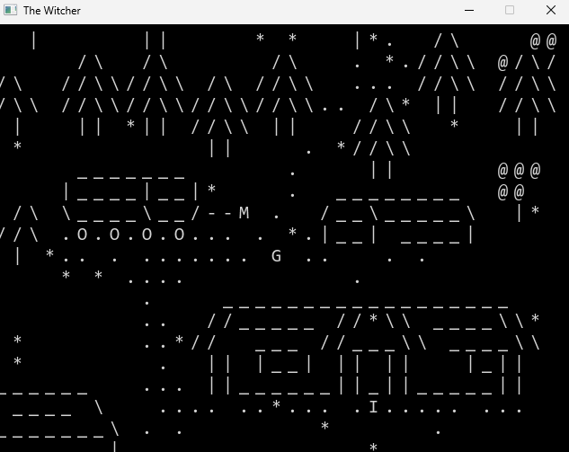
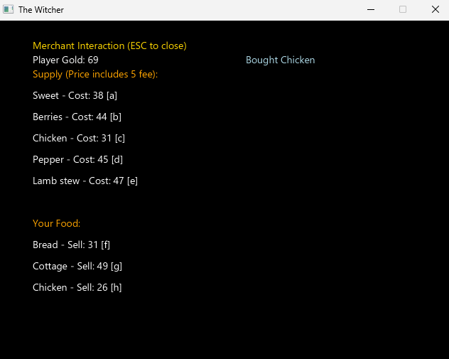
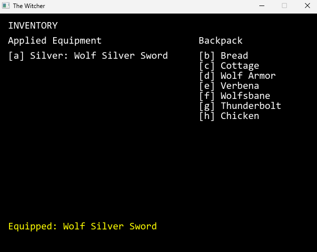
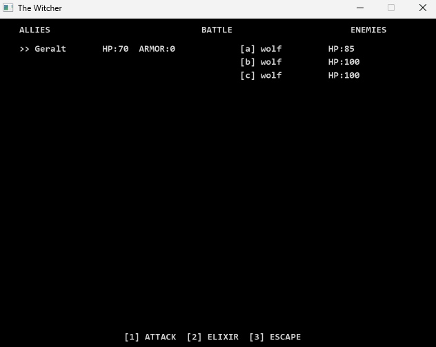

# The Witcher Game — AGH Object-Oriented Programming Project

A command-line RPG inspired by The Witcher universe, developed as an academic group project.

The game features an open-world map, NPC interactions, combat, inventory and equipment management, item trading, quests, resource gathering and game state persistence.

## Project overview

The player explores a world represented by a text-based map and can interact with different characters, enemies and objects.

The game includes several types of NPCs, each providing different interactions:

- **Merchant** — buys and sells items
- **Armorer** — repairs armor
- **Blacksmith** — repairs equipment
- **Innkeeper** — provides services at the inn
- **Sorceress** — provides quests

The player can also encounter enemies like Ghouls, Wolves and Bandits and engage in combat with them.

The game includes an inventory and equipment system, allowing the player to collect, purchase and use various items, equip different armor and weapons, and manage their resources.

Herbs can be collected throughout the world and exchanged for potions.

The current game state can be saved to and loaded from a `.dat` file, allowing the player to continue their progress.

## My role

This was a two-person academic group project.

My main responsibilities included:

- designing and implementing the game world map
- developing the combat system
- integrating different game mechanics into the overall application

## Project preview

### Game world

### Trading with Merchant

### Player's inventory

### Battle with enemies

